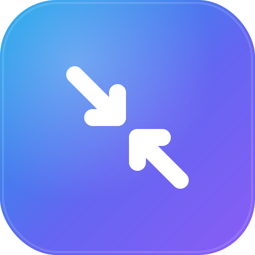

<p align="center">
  
</p>

<h1 align="center">Sizer</h1>

<p align="center">
  macOS 메뉴바(트레이) 영상·이미지 변환 앱 — 드롭 폴더에 넣으면 <b>고화질 저용량</b>으로
  변환하고, <b>움직임 없는(정지) 구간</b>을 잘라냅니다. 변환 엔진은 ffmpeg + macOS ImageIO입니다.
</p>

> 기존 Python 백그라운드 워커(`watch_convert.py`)를 네이티브 SwiftUI 앱으로 개편한 버전입니다.
> 예전 파일은 `legacy/`에 보존되어 있습니다.

## 요구사항

- **macOS 13+**
- **ffmpeg** — `brew install ffmpeg` (영상 변환에 필요. 이미지 변환은 macOS 내장 ImageIO 사용)
- 빌드 시: **Xcode 15+**, **XcodeGen** — `brew install xcodegen`

## 설치 (개인용 · 미공증 로컬 빌드)

```bash
brew install xcodegen ffmpeg     # 이미 있으면 생략
./scripts/install_local.sh
```

- 소스에서 Release 빌드 → ad-hoc 서명 → `/Applications/Sizer.app` 설치 → 실행합니다.
- Apple Developer ID / 공증이 필요 없습니다(이 머신 전용).
- 메뉴바에 아이콘이 나타납니다. Dock 아이콘은 없습니다(`LSUIElement`).
- 첫 알림 때 macOS가 알림 권한을 물으면 **허용**하세요.

## 기본 폴더

앱 최초 실행 시 자동 생성되며, **설정에서 모두 변경**할 수 있습니다.

| 폴더 | 용도 |
|------|------|
| `~/Movies/Sizer/drop` | 여기에 영상을 넣으면 자동 감지·변환 (드롭 타깃) |
| `~/Movies/Sizer/output` | 변환 결과 (`원본이름_resize.mp4`) |
| `~/Movies/Sizer/processed` | 변환 성공한 원본 이동 |
| `~/Movies/Sizer/failed` | 변환 실패한 원본 이동 |
| `~/Movies/Sizer/logs/convert.log` | 실행 로그 |

## 설정 (메뉴바 → 설정…)

- **일반**: 드롭/출력/완료/실패 폴더 변경, 로그인 시 자동 시작, 알림 on/off, **오래된 원본 자동 삭제(processed, 기본 켬·30일)**
- **인코딩**: 코덱(H.264/H.265/VideoToolbox), CRF, Preset, 장변 최대(px), 오디오 비트레이트, 출력 접미사
- **트리밍**: 자동 제거 on/off, 민감도 프리셋, 감지 임계값·최소 정지 길이, 컷 병합 간격, 최소 유지 길이, 컷 여유(패딩), 부드러운 전환, 안전장치 비율
- **이미지**: 이미지 변환 on/off, 포맷(AVIF/HEIC/JPEG/PNG), 품질, 최대 크기(장변)

> 메뉴바의 **최근 변환** 목록에서 성공 항목을 클릭하면 결과 영상은 재생, 이미지는 기본 앱에서 열립니다.

### processed 폴더 자동 정리

변환에 성공한 원본은 `processed` 폴더에 쌓입니다. **기본값(켬)**으로, processed에 들어온 지
**보관 기간(기본 30일, 7/30/90/180일 선택)** 을 넘긴 원본을 자동 삭제합니다(앱 시작 시 + 1시간마다 점검).
숨김 파일·다른 폴더는 건드리지 않으며, 각 삭제는 로그에 남습니다. 설정 → 일반에서 끄거나 기간을 바꿀 수 있습니다.

### 움직임 없는 구간 자동 제거 (개선점)

ffmpeg `freezedetect`로 정지 구간을 찾아 잘라내고 움직임 구간만 이어붙입니다. 기존 대비 개선:

- **감지 정확도**: 임계값(dB)·최소 정지 길이를 노출하고 **민감도 프리셋**(공격적/균형/보수적)으로 조절.
  아주 짧은 움직임 조각(`최소 유지 길이` 미만)은 버려 감지 노이즈로 인한 마이크로컷을 제거.
- **컷 부드러움**: 각 유지구간 앞뒤에 **여유(패딩)** 를 줘 시작/끝 프레임이 잘리지 않고 자연스럽게 이어지며,
  concat 경계마다 짧은 **오디오 페이드**로 클릭/팝을 제거. `부드러운 전환` 옵션으로 페이드를 늘릴 수 있음.
- **안전장치**: 잘라낸 뒤 남는 길이가 원본의 설정 비율 미만이거나 제거량이 미미하면 트리밍을 취소하고 원본대로 변환.

핵심 로직은 순수 함수(`SegmentPlanner`)로 분리해 단위 테스트로 고정되어 있습니다.

### 이미지 캡처 변환

드롭 폴더에 들어온 이미지(png·jpg·heic·tiff·bmp·gif 등, 특히 스크린샷)를 **고화질 저용량**으로
재인코딩합니다. macOS 네이티브 ImageIO를 사용하며(ffmpeg 불필요), 기본 포맷은 **AVIF**입니다.

- 포맷 AVIF/HEIC/JPEG/PNG, 품질(손실 포맷), 최대 크기(장변, `원본 유지` 기본) 를 설정에서 조절.
- 실측: 스크린샷 PNG 기준 대략 **70~95% 용량 절감**(화질 유지).
- 출력은 영상과 동일한 출력 폴더 + 접미사(`_resize`) 규칙을 따릅니다.

## 개발

```bash
xcodegen generate                                              # project.yml → Sizer.xcodeproj
xcodebuild -project Sizer.xcodeproj -scheme Sizer -destination 'platform=macOS' build
xcodebuild -project Sizer.xcodeproj -scheme Sizer -destination 'platform=macOS' test
```

구조:

```
Sizer/
  SizerApp.swift              @main + AppDelegate (NSStatusItem 트레이 + 팝오버, 아이콘 애니메이션)
  Model/                      AppSettings, ConversionConfig, VideoCodec, TrimOptions, ImageFormat, Segment, JobRecord
  Engine/                     FFmpeg, Probe, FreezeDetector, SegmentPlanner, FilterGraphBuilder, ConversionEngine,
                              ImageConverter, FolderWatcher(FSEvents), WatchCoordinator, ProcessedCleaner
  Services/                   Notifier(UserNotifications), LoginItem(SMAppService), AppLogger
  UI/                         MenuBarView, SettingsWindowController, Settings/{General,Encoding,Trimming,Image}SettingsView
SizerTests/                   순수 로직 단위(SegmentPlanner·ProcessedCleaner) + 실제 ffmpeg/ImageIO 통합 테스트
scripts/install_local.sh      개인용 설치(ad-hoc)
scripts/build_release.sh      [후속] Developer ID 서명+공증 템플릿
legacy/                       구 Python 워커 보존
```

> `Sizer.xcodeproj`는 `project.yml`에서 생성되므로 저장소에 포함하지 않습니다(`xcodegen generate`로 생성).

## 배포 (후속 과제)

현재는 **개인용 미공증 ad-hoc 빌드**입니다. 다른 사람과 공유하려면 Apple Developer ID가 필요합니다.
계정 확보 후 `scripts/build_release.sh`(정적 ffmpeg 번들 + Developer ID 서명 + 공증)를 준비해 두었습니다.

## 기여

버그 리포트·기능 제안·PR 환영합니다. 빌드/테스트 방법과 프로젝트 구조는 [CONTRIBUTING.md](CONTRIBUTING.md)를,
변경 이력은 [CHANGELOG.md](CHANGELOG.md)를 참고하세요.

## 라이선스

[MIT](LICENSE). Sizer는 ffmpeg를 별도 실행 파일로 호출할 뿐 링크하지 않으므로 Sizer 소스 코드는 MIT로
자유롭게 사용할 수 있습니다. ffmpeg 자체는 각자의 라이선스(GPL/LGPL)를 따르며, 바이너리를 함께 재배포할
경우 해당 라이선스를 준수해야 합니다.
