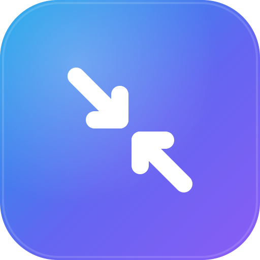

<p align="center">
  
</p>

<h1 align="center">Sizer</h1>

<p align="center">
  macOS 메뉴바(트레이) 영상·이미지 변환 앱 — 화면 가장자리 <b>드롭·셸프 패널</b>에 끌어다 놓으면
  <b>고화질 저용량</b>으로 변환하고, <b>저모션 구간</b>은 빨리감기로 줄입니다. 변환 엔진은 ffmpeg + macOS ImageIO입니다.
  전역 단축키 <b>창 스냅</b>으로 현재 창을 2분할·3분할로 정렬하고 모니터 사이로 옮기는 기능도 있습니다.
</p>

<p align="center">
  <a href="https://github.com/KunmyonChoi/sizer/releases/download/v1.4.0/sizer-tutorial.mp4">
    
  </a>
</p>
<p align="center">
  <a href="https://github.com/KunmyonChoi/sizer/releases/download/v1.4.0/sizer-tutorial.mp4">▶ 30초 튜토리얼 영상 보기 (MP4 · 1080p)</a>
</p>

> 기존 Python 백그라운드 워커(`watch_convert.py`)를 네이티브 SwiftUI 앱으로 개편한 버전입니다.
> 예전 파일은 `legacy/`에 보존되어 있습니다.

## 요구사항

- **macOS 13+**
- **ffmpeg** — `brew install ffmpeg` (영상 변환에 필요. 이미지 변환은 macOS 내장 ImageIO 사용)
- 빌드 시: **전체 Xcode 15+** (Mac App Store 설치 — `xcode-select --install`로 받는 Command Line Tools만으로는
  빌드되지 않습니다), **XcodeGen** — `brew install xcodegen`

> Sizer는 배포 바이너리가 아니라 **여러분의 Mac에서 소스를 빌드**해 설치합니다. 그래서 전체 Xcode가 필요하며,
> **Xcode를 한 번도 실행한 적이 없다면 아래 [Xcode 준비](#xcode-준비-처음-한-번만)를 먼저 끝내야** 설치가 됩니다.

## 설치

Sizer는 미리 빌드된 바이너리가 아니라 **여러분의 Mac에서 소스를 빌드**해 설치합니다(Apple 공증 없이도 Gatekeeper
경고 없이 쓰기 위함). 방법은 두 가지이고, **대부분의 사용자는 A(Homebrew)** 를 쓰면 됩니다.

| 방법 | 추천 대상 | 장점 | 단점 |
|---|---|---|---|
| **A. Homebrew** | **대부분의 사용자 · 배포** | 한 줄 설치, `brew upgrade` 로 간단 업데이트 | 업데이트할 때마다 **창 스냅**의 손쉬운 사용 권한을 다시 허용해야 함(ad-hoc 서명이라 빌드마다 코드 신원이 바뀜) |
| **B. 소스 직접 빌드** | 개발자 · 창 스냅을 자주 쓰는 경우 | 자체 서명 인증서로 **창 스냅 권한이 재빌드에도 유지됨** | 업데이트가 수동(`git pull` + 스크립트) |

> 두 방법 모두 빌드에 **전체 Xcode**가 필요합니다. Xcode를 한 번도 실행한 적 없다면 먼저
> [Xcode 준비](#xcode-준비-처음-한-번만)를 끝내세요. **창 스냅을 안 쓰면(변환만 쓰면) 두 방법의 실사용 차이는 없습니다** —
> 이때는 A(Homebrew)가 가장 편합니다.

### Xcode 준비 (처음 한 번만)

Xcode를 이미 한 번 실행해 구성요소 설치·라이선스 동의까지 마친 분은 이 단계를 건너뛰어도 됩니다.
**Xcode가 없거나 설치 후 한 번도 연 적이 없다면** 아래를 순서대로 진행하세요. Xcode 앱 창을 직접 열 필요는 없고,
모두 터미널로 끝납니다.

1. **App Store에서 Xcode 설치** — [App Store에서 Xcode 열기](https://apps.apple.com/app/xcode/id497799835)
   (수 GB라 다운로드에 시간이 걸립니다). 이미 설치돼 있으면 건너뜁니다.
2. **빌드 도구를 방금 설치한 Xcode로 지정** (Command Line Tools가 아니라 전체 Xcode를 쓰도록):
   ```bash
   sudo xcode-select -s /Applications/Xcode.app/Contents/Developer
   ```
3. **라이선스 동의 + 첫 실행 구성요소 설치** (원래 Xcode를 처음 열 때 하는 과정을 터미널로 대신):
   ```bash
   sudo xcodebuild -license accept
   sudo xcodebuild -runFirstLaunch
   ```
4. **확인** — 버전 문자열이 출력되면 준비 완료입니다:
   ```bash
   xcodebuild -version
   ```

<details>
<summary>설치 중 이런 오류가 난다면</summary>

- `tool 'xcodebuild' requires Xcode, but active developer directory '/Library/Developer/CommandLineTools' is a command line tools instance`
  → 전체 Xcode를 가리키지 않은 것입니다. **2번**(`sudo xcode-select -s ...`)을 실행하세요.
- `You have not agreed to the Xcode/iOS license agreements`
  → **3번**의 `sudo xcodebuild -license accept`를 실행하세요.
- `xcode-select: error: unable to get active developer directory` 또는 Xcode.app 경로가 다르면
  실제 설치 위치로 `-s` 경로를 바꿔 주세요(예: `/Applications/Xcode-beta.app/Contents/Developer`).
</details>

### 방법 A — Homebrew (권장 · 대부분의 사용자)

```bash
brew install KunmyonChoi/tap/sizer
sizer
```

소스에서 **로컬 빌드**되므로 Apple 개발자 등록/공증 없이도 **Gatekeeper 경고 없이** 설치됩니다
(빌드에 Xcode, 변환에 ffmpeg가 필요하며 ffmpeg는 자동 설치됩니다).

> ℹ️ **`brew install` 만으로는 `/Applications`에 등록되지 않습니다.** Homebrew 소스 빌드(formula)는 설치 샌드박스가
> `/Applications` 쓰기를 막기 때문입니다(우회 불가). 아래 **`sizer` 명령이 최초 1회에 링크를 만들어** 해결합니다.

설치 후 **`sizer` 명령으로 실행**합니다. 이 명령은 앱을 실행하면서 **최초 1회 `/Applications`(권한이 없으면
`~/Applications`)에 `Sizer.app` 링크를 자동 생성**하므로, 이후에는 Spotlight·런치패드나 `open -a Sizer`로도
열 수 있습니다. 실행되면 **메뉴바에 아이콘**이 나타납니다(Dock 아이콘 없음, `LSUIElement`).

링크만 만들고 실행은 원치 않으면: `ln -sfn $(brew --prefix)/opt/sizer/Sizer.app /Applications/Sizer.app`

- 이미 설치돼 있다면 최신으로 업데이트: `brew upgrade sizer`
- 최신 개발 버전: `brew install --HEAD KunmyonChoi/tap/sizer`

> ⚠️ **창 스냅을 쓴다면**: `brew upgrade` 로 새로 빌드할 때마다 코드 신원(CDHash)이 바뀌어, **손쉬운 사용 권한을
> 다시 허용**해야 합니다(변환·이미지 기능은 권한과 무관하니 영향 없음). 재허용이 번거로우면 아래 **방법 B**를 쓰세요.
> 재허용 방법: 시스템 설정 → 개인정보 보호 및 보안 → 손쉬운 사용에서 기존 "Sizer" 항목을 지우고 다시 켜기.

### 방법 B — 소스에서 직접 빌드 (창 스냅 권한 유지)

이 레포를 clone 한 뒤:

```bash
brew install xcodegen ffmpeg          # 이미 있으면 생략
./scripts/setup_signing_cert.sh       # (권장·1회) 자체 서명 인증서 — 창 스냅 권한을 재빌드에도 유지
./scripts/install_local.sh            # 빌드 → 서명 → /Applications 설치 → 실행
```

- **실행**: `open -a Sizer` 또는 Spotlight·런치패드에서 "Sizer". **업데이트**: `git pull && ./scripts/install_local.sh`.
- `setup_signing_cert.sh` 를 먼저 실행해 두면 `install_local.sh` 가 그 **자체 서명 인증서**로 서명합니다(안 하면 ad-hoc).
  인증서로 서명하면 코드 신원이 고정돼 **손쉬운 사용 권한을 최초 1회만 허용**하면 이후 재빌드에도 유지됩니다
  (머신당 1회 설정, 로그인 암호 필요). 이게 방법 B의 핵심 장점입니다.
- Apple Developer ID / 공증이 필요 없습니다(로컬 빌드라 Gatekeeper 경고 없음). 메뉴바 아이콘, Dock 아이콘 없음(`LSUIElement`).
- 첫 알림 때 macOS가 알림 권한을 물으면 **허용**하세요.

> Homebrew 설치본(방법 A)은 각 PC에서 ad-hoc으로 빌드되므로 이 인증서 서명이 적용되지 않습니다 —
> 인증서로 권한을 유지하는 방식은 **소스 빌드(방법 B) 전용**입니다.

### 트러블슈팅 — 방법 A와 B를 둘 다 설치한 경우

두 방법을 모두 설치하면 **같은 앱이 두 벌** 생겨 헷갈릴 수 있습니다(Homebrew Cellar 빌드 + `/Applications`의 로컬 빌드).
증상과 정리 방법:

**증상**
- 검색·Spotlight에 "Sizer"가 여러 개로 보임.
- `sizer` 명령과 `open -a Sizer` 가 **서로 다른 빌드**를 엶: `sizer` = Homebrew(Cellar, ad-hoc), `open -a Sizer` = `/Applications`(로컬 빌드).
- **창 스냅 권한이 자꾸 초기화**됨 — 두 빌드의 코드 신원이 달라 한쪽에 권한을 줘도 다른 쪽 실행 시 안 먹음.
- 동시에 실행돼도 하나만 뜸(중복 실행 방지 가드).

**지금 무엇이 설치·실행 중인지 확인**
```bash
ls -ld /Applications/Sizer.app                                   # 심링크=Homebrew, 실제 폴더=로컬 빌드
codesign -dvvv /Applications/Sizer.app 2>&1 | grep -E "Authority|Signature"  # "Sizer Local Signing"=인증서 로컬 빌드, adhoc=ad-hoc
pgrep -fl "Sizer.app/Contents/MacOS/Sizer"                       # 실행 중 인스턴스의 실제 경로
```

**하나로 정리 (택1)**
- **Homebrew만 쓰기**: `rm -rf /Applications/Sizer.app` 후 `sizer` 실행(→ `/Applications`에 Homebrew를 가리키는 링크 재생성). 실행은 `sizer`.
- **로컬 빌드만 쓰기**: `brew uninstall sizer`(→ Cellar와 `sizer` 명령 제거). 실행은 `open -a Sizer`.
- 어느 쪽이든, 시스템 설정 → 개인정보 보호 및 보안 → **손쉬운 사용**에서 **낡은 "Sizer" 항목을 모두 지우고** 새로 한 번만 허용하세요.

> 참고: 방법 B로 빌드하면 프로젝트 `build/` 폴더의 **빌드 산출물**이 Spotlight에 잡혀 "Sizer"가 하나 더 보일 수 있습니다.
> 현재 `install_local.sh` 는 빌드 출력을 `.noindex` 폴더에 두어 색인되지 않게 합니다. 예전 잔여물이 남아 보이면 `rm -rf build` 로 지우세요.

## 기본 폴더

앱 최초 실행 시 자동 생성되며, **설정에서 모두 변경**할 수 있습니다.

| 폴더 | 용도 |
|------|------|
| `~/Movies/Sizer/drop` | 여기에 영상을 넣으면 자동 감지·변환 (드롭 타깃) |
| `~/Movies/Sizer/output` | 변환 결과 (`원본이름_resize.mp4`) |
| `~/Movies/Sizer/processed` | 변환 성공한 원본 이동 |
| `~/Movies/Sizer/failed` | 변환 실패한 원본 이동 |
| `~/Movies/Sizer/logs/convert.log` | 실행 로그 |

## 설정 (메뉴바 → 설정…)

- **일반**: 드롭/출력/완료/실패 폴더 변경, 로그인 시 자동 시작, 알림 on/off, **드롭 타겟 변환 후 출력 폴더 열기(기본 켬)**, **오래된 원본 자동 삭제(processed, 기본 켬·30일)**
- **드롭 & 셸프**: **드롭 타겟을 파일 셸프에 통합(기본 켬)**, **변환 결과를 셸프에 추가(기본 켬)**, **패널 위치(왼쪽/오른쪽, 기본 오른쪽)**, **패널 열기/닫기 전역 단축키**
- **인코딩**: 코덱(H.264/H.265/VideoToolbox), CRF, Preset, 장변 최대(px), 오디오 비트레이트, 출력 접미사
- **트리밍**: 정지/저모션 구간 처리 모드 — **끔 / 잘라내기 / 빨리감기(Beta·기본)**, 민감도 프리셋(**기본 보수적**), 감지 임계값·최소 정지 길이, **적응형 임계값(노이즈 콘텐츠, 옵션)**, (잘라내기) 컷 병합/최소 유지/패딩/부드러운 전환/안전장치, (빨리감기) 배속·최소 구간·오디오 음소거·배지
- **이미지**: 이미지 변환 on/off, 포맷(AVIF/HEIC/JPEG/PNG), 품질, 최대 크기(장변)
- **창 스냅**: 창 스냅 사용(기본 켬), **2분할**(기본 `⌃⌥←` / `⌃⌥→` / `⌃⌥↩`), **3분할**(기본 `⌃⌥⇧←` / `⌃⌥⇧→`),
  **화면 간 이동**(기본 `⌃⌥⌘←` / `⌃⌥⌘→`), 손쉬운 사용 권한 상태·바로가기
- **꺼짐 방지**: 모니터 꺼짐 방지 사용(지금 켜기), 전환 단축키

> 메뉴바의 **최근 변환** 목록에서 성공 항목을 클릭하면 결과 영상은 재생, 이미지는 기본 앱에서 열립니다.

### 드롭·셸프 통합 패널

메뉴바 → **드롭·셸프 패널 표시** 를 켜면 화면 **가장자리에 얇은 탭**으로 접혀 있습니다(설정에서 왼쪽/오른쪽 선택,
기본 오른쪽 · 화면을 거의 안 먹음). 파일을 그쪽으로 **드래그해 접근하거나 마우스를 대면** 패널이 펼쳐지며,
한 표면 안에 두 존이 나타납니다.

- **상단 · 변환 드롭존** — 영상·이미지를 놓으면 드롭 폴더로 복사되어 **곧바로 변환**됩니다. 드래그하는 동안
  변환 가능한 형식이면 존이 강조되고("여기에 놓기"), **변환할 수 없는 형식이면 거부**됩니다(놓기 불가 커서).
- **하단 · 보관 트레이** — Finder에서 파일을 끌어와 **임시로 담아 두는** 곳입니다. 원하는 위치로 이동한 뒤
  **개별/다중 선택**해 그 위치로 **드래그해 꺼내면** 파일이 이동/복사됩니다(같은 볼륨은 이동, 다른 볼륨/⌥는 복사
  — macOS 표준). 원본을 **참조**하므로 복사본이 쌓이지 않고, 이동으로 꺼낸 항목은 자동으로 사라집니다.

드래그하는 동안 **커서가 놓인 존만** 강조되어 놓기 전에 변환/보관 결과를 알 수 있습니다. 변환이 끝나면 결과
파일이 보관 트레이 맨 앞에 **NEW** 배지와 함께 얹혀, 바로 원하는 곳으로 끌어낼 수 있습니다.

- 접힌 탭은 **마우스가 있는 화면**의 선택한 가장자리를 따라 이동하므로 다중 모니터에서도 항상 닿습니다.
- **설정 → 드롭 & 셸프**에서 패널을 **왼쪽/오른쪽**에 둘 수 있고(기본 오른쪽), **전역 단축키**를 지정하면 어디서든
  패널을 열고 닫을 수 있습니다(접근성 권한 불필요).
- 모니터 구성이 바뀌어도 패널이 **화면 밖으로 사라지지 않도록** 위치를 보정합니다.
- 설정 → **드롭 & 셸프**에서 통합을 끄면, 예전처럼 자유롭게 이동하는 **드롭 타겟**과 **파일 셸프**가 분리됩니다.

### processed 폴더 자동 정리

변환에 성공한 원본은 `processed` 폴더에 쌓입니다. **기본값(켬)**으로, processed에 들어온 지
**보관 기간(기본 30일, 7/30/90/180일 선택)** 을 넘긴 원본을 자동 삭제합니다(앱 시작 시 + 1시간마다 점검).
숨김 파일·다른 폴더는 건드리지 않으며, 각 삭제는 로그에 남습니다. 설정 → 일반에서 끄거나 기간을 바꿀 수 있습니다.

### 정지/저모션 구간 처리 (끔 / 잘라내기 / 빨리감기)

설정 → 트리밍에서 모드를 고릅니다(**기본값 빨리감기(Beta) · 민감도 보수적**).

- **잘라내기**: ffmpeg `freezedetect`로 정지 구간을 찾아 잘라내고 움직임 구간만 이어붙입니다.
- **빨리감기 (Beta)**: 잘라내지 않고 **저모션 구간(긴 대기·진행바 등)을 배속(2/4/8×) 재생**해 지루함을
  줄이되 진행/맥락은 유지합니다. 구간별로 `setpts`/`atempo`를 적용해 이어붙이며, 배속 구간은 오디오를
  음소거하고 화면 우측 상단에 **»N× 배지**를 표시합니다. 저모션 감지 정확도를 개선 중인 **Beta 기능**입니다.

**잘라내기** 모드의 세부 개선:

- **감지 정확도**: 임계값(dB)·최소 정지 길이를 노출하고 **민감도 프리셋**(공격적/균형/보수적)으로 조절.
  아주 짧은 움직임 조각(`최소 유지 길이` 미만)은 버려 감지 노이즈로 인한 마이크로컷을 제거.
  감지는 **저해상도 프록시(다운스케일+약한 블러)** 에서 수행해 노이즈에 강건하며(깨끗한 화면 녹화는 무회귀),
  **장면 전환 가드**로 실제 컷을 가로질러 병합하지 않습니다. **적응형 임계값(옵션)** 을 켜면 노이즈 있는 영상에서
  정지 구간을 놓치지 않도록 임계값을 검증된 안전 범위(−50dB)까지만 자동 완화합니다.
- **컷 부드러움**: 각 유지구간 앞뒤에 **여유(패딩)** 를 줘 시작/끝 프레임이 잘리지 않고 자연스럽게 이어지며,
  concat 경계마다 짧은 **오디오 페이드**로 클릭/팝을 제거. `부드러운 전환` 옵션으로 페이드를 늘릴 수 있음.
- **안전장치**: 잘라낸 뒤 남는 길이가 원본의 설정 비율 미만이거나 제거량이 미미하면 트리밍을 취소하고 원본대로 변환.

핵심 로직은 순수 함수(`SegmentPlanner`)로 분리해 단위 테스트로 고정되어 있습니다.

### 이미지 캡처 변환

드롭 폴더에 들어온 이미지(png·jpg·heic·tiff·bmp·gif 등, 특히 스크린샷)를 **고화질 저용량**으로
재인코딩합니다. macOS 네이티브 ImageIO를 사용하며(ffmpeg 불필요), 기본 포맷은 **AVIF**입니다.

- 포맷 AVIF/HEIC/JPEG/PNG, 품질(손실 포맷), 최대 크기(장변, `원본 유지` 기본) 를 설정에서 조절.
- 실측: 스크린샷 PNG 기준 대략 **70~95% 용량 절감**(화질 유지).
- 출력은 영상과 동일한 출력 폴더 + 접미사(`_resize`) 규칙을 따릅니다.

### 창 스냅 (윈도우 타일링)

전역 단축키로 **현재 최상위 창**을 화면에 정렬합니다(Magnet/Rectangle 계열).

| 기본 단축키 | 동작 |
|---|---|
| `⌃⌥←` `⌃⌥→` | 창을 화면 **좌/우 절반**. 이미 그 절반이면 한 번 더 눌러 **그 방향 화면으로** |
| `⌃⌥⇧←` `⌃⌥⇧→` | 창을 좌/우 **1/3 ↔ 2/3** 토글 (와이드 화면 3분할) |
| `⌃⌥↩` | 창을 **최대화**(메뉴바·Dock 제외) |
| `⌃⌥⌘←` `⌃⌥⌘→` | 비율을 유지한 채 **이전/다음 화면으로** |

**2분할과 3분할은 서로 다른 키**입니다. 한 키를 반복해도 예상 못 한 비율로 넘어가지 않고, 각 키가
하는 일이 하나씩이라 몇 번 눌러야 할지 예측됩니다.

#### 와이드 화면 3분할

`⌃⌥⇧←` / `⌃⌥⇧→` 는 누를 때마다 1/3 과 2/3 을 오갑니다. 2/3 + 1/3 조합은 **두 창 모두 두 번**입니다.

```
⌃⌥⇧←        ⌃⌥⇧← 한 번 더      ⌃⌥⇧→        ⌃⌥⇧→ 한 번 더
좌 1/3   →   좌 2/3         우 1/3   →   우 2/3
```

3분할 키는 화면을 넘지 않습니다 — 넘기는 일은 절반 키와 즉시 이동 키가 맡습니다.

#### 멀티 모니터

화면을 고르는 규칙이 키마다 다릅니다. 미는 방향과 도착지를 맞추면서도 모든 화면에 드나들 수 있게
하기 위해서입니다.

- **`⌃⌥←` / `⌃⌥→`** — 가로로 겹치지 않는 **진짜 왼쪽·오른쪽 화면**으로만 넘어갑니다. 가로가 겹치는
  화면은 좌우가 아니라 위아래 관계이므로(노트북 위에 모니터를 올린 배치) 건너뜁니다. 그 방향에 화면이
  없으면 그대로 머물고, 반대편으로 순환하지 않습니다.
- **`⌃⌥⌘←` / `⌃⌥⌘→`** — 모든 화면을 **왼쪽 끝 순서**로 순회합니다(왼쪽 끝이 같으면 위쪽 화면이 앞).
  절반 키가 건너뛰는 화면 — 다른 화면에 가로로 감싸인 화면 — 에 드나드는 길입니다. 칸에 놓인 창은
  그 칸을 그대로 가져가고, 칸에 없는 창은 상대 위치·크기를 비례 변환해 목적지 화면 안에 맞춥니다.
- 크기가 다른 모니터로 넘어가도 목적지 화면 크기에 맞춰 정확히 리사이즈됩니다.
- 설정 → **창 스냅**에서 사용 여부, 단축키 재지정, 권한 상태를 관리합니다. **메뉴바에서도 켜고 끌 수 있습니다.**
- 다른 앱의 창을 옮기려면 **손쉬운 사용(Accessibility) 권한**이 필요합니다(macOS 공통 제약). 최초 사용 시
  권한 프롬프트가 뜨며, 시스템 설정 → 개인정보 보호 및 보안 → 손쉬운 사용에서 Sizer를 켜세요. 로컬 재빌드로
  앱을 교체하면 권한 항목이 갱신 대상이 될 수 있으니, 적용되지 않으면 목록에서 제거 후 다시 추가하거나 Sizer를 재실행하세요.

> 화면 끝으로 **드래그해 스냅**하는 동작 + 미리보기 오버레이는 후속(2차)으로 추가할 예정입니다.

### 모니터 꺼짐 방지

메뉴바 → **모니터 꺼짐 방지** 를 켜면 화면이 자동으로 꺼지거나 절전되지 않습니다(발표·긴 다운로드·모니터링 등).
켜져 있는 동안 트레이 아이콘이 **☀️** 로 바뀝니다. 설정 → 일반에서 **전환 단축키**를 지정하면 어디서든 켜고 끌 수 있습니다.

- macOS 표준 **IOKit 전원 어서션**(`kIOPMAssertionTypePreventUserIdleDisplaySleep`)을 사용합니다 —
  **별도 권한이 필요 없고** `caffeinate` 서브프로세스도 쓰지 않습니다.
- 기본 **꺼짐**이며 **앱을 끄면 자동 해제**됩니다. `pmset -g assertions`로 활성 여부를 확인할 수 있습니다.

## 개발

```bash
xcodegen generate                                              # project.yml → Sizer.xcodeproj
xcodebuild -project Sizer.xcodeproj -scheme Sizer -destination 'platform=macOS' build
xcodebuild -project Sizer.xcodeproj -scheme Sizer -destination 'platform=macOS' test
```

구조:

```
Sizer/
  SizerApp.swift              @main + AppDelegate (NSStatusItem 트레이 + 팝오버, 아이콘 애니메이션)
  Model/                      AppSettings, ConversionConfig, VideoCodec, TrimOptions, ImageFormat, Segment, JobRecord
  Engine/                     FFmpeg, Probe, FreezeDetector, SegmentPlanner, FilterGraphBuilder, ConversionEngine,
                              ImageConverter, FolderWatcher(FSEvents), WatchCoordinator, ProcessedCleaner
  Services/                   Notifier(UserNotifications), LoginItem(SMAppService), AppLogger
  UI/                         MenuBarView, SettingsWindowController, Settings/{General,Encoding,Trimming,Image}SettingsView
SizerTests/                   순수 로직 단위(SegmentPlanner·ProcessedCleaner) + 실제 ffmpeg/ImageIO 통합 테스트
scripts/install_local.sh      개인용 설치(ad-hoc)
scripts/build_release.sh      [후속] Developer ID 서명+공증 템플릿
legacy/                       구 Python 워커 보존
```

> `Sizer.xcodeproj`는 `project.yml`에서 생성되므로 저장소에 포함하지 않습니다(`xcodegen generate`로 생성).

## 배포 (후속 과제)

현재는 **개인용 미공증 ad-hoc 빌드**입니다. 다른 사람과 공유하려면 Apple Developer ID가 필요합니다.
계정 확보 후 `scripts/build_release.sh`(정적 ffmpeg 번들 + Developer ID 서명 + 공증)를 준비해 두었습니다.

## 기여

버그 리포트·기능 제안·PR 환영합니다. 빌드/테스트 방법과 프로젝트 구조는 [CONTRIBUTING.md](CONTRIBUTING.md)를,
변경 이력은 [CHANGELOG.md](CHANGELOG.md)를 참고하세요.

## 라이선스

[MIT](LICENSE). Sizer는 ffmpeg를 별도 실행 파일로 호출할 뿐 링크하지 않으므로 Sizer 소스 코드는 MIT로
자유롭게 사용할 수 있습니다. ffmpeg 자체는 각자의 라이선스(GPL/LGPL)를 따르며, 바이너리를 함께 재배포할
경우 해당 라이선스를 준수해야 합니다.

튜토리얼 영상(`tutorial/`)은 [hyperframes](https://github.com/heygen-com/hyperframes)로 제작했으며,
[Pretendard](https://github.com/orioncactus/pretendard) 폰트([OFL 1.1](tutorial/assets/fonts/OFL.txt))와
자체 제작 배경음악(`tutorial/assets/bgm.mp3`, MIT)을 사용합니다.
